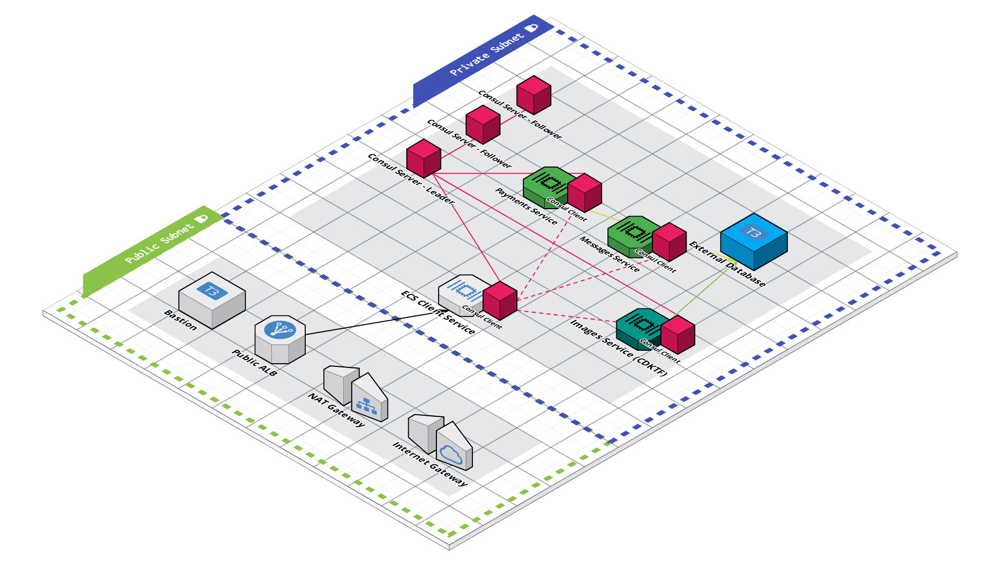

# Sentinel with Terraform, Amazon ECS, and Consul

This repository creates [HashiCorp Sentinel](https://www.hashicorp.com/sentinel) Policies to guard against unwanted changes to Terraform code.  It was created to demonstrate policy-as-code alongside two other repositories:

1. [Terraform with Amazon ECS and Consul](https://github.com/jcolemorrison/terraform-ecs-consul)
  - deploys the core infrastructure that supports this project. It's referenced as teh "parent workspace" or "parent" project throughout this code.
2. [CDK for Terraform with Amazon ECS and Consul](https://github.com/jcolemorrison/cdktf-ecs-consul)
  - deploys an additional ECS microservice via the [CDK for Terraform](https://www.terraform.io/cdktf)

All of the `aws` functions and `common-functions` are lifted from the [Terraform Sentinel Policies](https://github.com/hashicorp/terraform-sentinel-policies) repository.

## The Architecture

The above represents the architecture these policies guard.

## How to Use These Policies

Although these are meant to be used with the aforementioned repositories, they can be used with any workspace inside of [Terraform Cloud](https://cloud.hashicorp.com/products/terraform).  To make them available for usage:

1. Fork this repo or clone it and create your own repo from it.

2. Head to **Settings** in your Terraform Cloud console

3. Click on **Policy Sets** in the side navigation bar

4. Click on **Connect a new policy set** in the **Policy Sets** screen

5. Follow the **Connect a Policy Set** step-by-step

6. Name the policy set whatever you'd like

7. Under the **Workspaces** area, select the specific workspaces you'd like this policy to guard.

8. Click **Connect policy set**

9. Optionally trigger a run in any of your workspaces to view the policy in action.

## Using More Policies

By default this repo will only check for certain tags on `aws_ecs_task_definition` resources for demonstration purposes.  However, there are a variety of other AWS specific policies that you can use.  To see all of them in usage view the file in [`aws/sentinel.hcl`](https://github.com/jcolemorrison/sentinel-ecs-consul/blob/main/aws/sentinel.hcl).